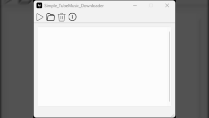
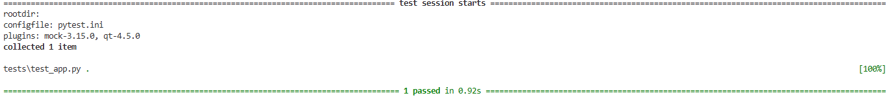

## 🎵 Simple-TubeMusic-Downloader
#### **PySide6 기반의 비동기 GUI 자동화 도구**

---

### 📺 시연 영상 (Demo)

> *클립보드 이벤트 감지 및 비동기 다운로드 프로세스 구현 시연*

---

### 📌 Motivation & Objective
*   **배경:** 반복적인 수동 URL 복사/붙여넣기 자동화 및 Windows 환경의 안정적 음원 추출 환경 구축.
*   **목표:** 비동기 설계와 방어적 프로그래밍을 통해 사용자 편의성과 프로그램 동작 신뢰성 동시 확보.

### ✅ 1. 주요 구현 및 최적화 항목 (Implementation)
UI 응답성과 데이터 정합성 확보를 위해 설계 단계부터 검증 절차를 도입했습니다.
*   **UI/UX Automation:** `dataChanged` 시그널 활용, 실시간 클립보드 감지 및 자동 리스트업 구현.
*   **Asynchronous Design:** `QThread` 기반 작업 분리로 대용량 다운로드 중 UI 프리징(Freezing) 방지.
*   **Portability:** `sys._MEIPASS` 경로 참조 로직 구현으로 배포 환경별 실행 안정성 확보.
*   **QA Process:** `pytest` 라이브러리를 활용하여 메인 윈도우 구성 요소 및 초기화 정합성 검증 (**Pass**).

> **📸 [이미지: Pytest 실행 결과 스크린샷]**
>
> 

### 📊 2. 시스템 운영 및 성능 데이터 (Performance)
사용자 경험과 저사양 기기 환경에서의 동작 신뢰성 사이의 균형을 고려했습니다.
*   **리소스 최적화:** 단일 작업 순차 큐(Sequential Queue) 방식을 채택하여 CPU 점유율 스파이크 제어.
*   **상태 기반 처리:** 별도 설정 파일 없이 파일 시스템 상태 대조를 통한 자동 이어받기(Resume) 수행.
*   **동작 검증:** 저전력 프로세서(i5-7200U) 및 Windows 11 환경에서도 시스템 프리징 없는 안정적 동작 확인.
*   **역량 입증:** 알고리즘 트레이닝(**프로그래머스 197문제 완주**)을 통한 코드 최적화 및 로직 정교화 기초 확보.

> **📸 [이미지: 프로그래머스 학습 현황 스크린샷]**
>
> 

### 🛡️ 3. 보안 및 견고성 (Security & Robustness)
비정상 입력값으로 인한 프로그램 강제 종료를 방지하기 위해 입력 단계의 검증을 강화했습니다.
*   **데이터 무결성:** 정규표현식(Regex) 패턴 적용으로 유효 유튜브 URL만 선택적 수집하여 정합성 확보.
*   **예외 핸들링:** 네트워크 단절 및 엔진 에러 코드를 실시간 트래킹하여 예외 상황 대응력 강화.

---

### 💡 4. 주요 분석 사례 (Engineer's Insights)
*   **시스템 아키텍처 이해:** 시그널/슬롯 구조 분석을 통해 데이터 감지에 적합한 최적의 시그널 선택 적용.
*   **구조적 한계 파악:** 동기식 출력 소비 방식이 대량 데이터 발생 시 I/O 병목을 유발할 수 있음을 인지.
*   **고도화 방향 수립:** 비동기 버퍼 드레인(Drain) 구조 도입을 통한 프로세스 제어 완결성 확보 계획 수립.

#### 🛠 Troubleshooting Log
**[Pipe Buffer 포화에 따른 프로세스 Startup Stall 및 종료 불가 현상 분석]**
*   **발생 일자:** 2026년 1월 3일
*   **현상 (Issue):** 
    * 다운로드 프로세스 생성 후 실질적 태스크 진입 불가(Stall) 및 작업 완료 후 프로세스 잔류 현상 관측. 사용자 측면에서 프로그램이 시작되지 않거나 종료되지 않는 '동결' 상태로 인지됨.
*   **분석 (Analysis):** 
    * 자식 프로세스의 초기 `stdout` 데이터가 OS 커널 파이프 버퍼 용량을 초과함에 따라 **I/O Deadlock** 발생. 부모 프로세스의 동기적 읽기 한계로 자식 프로세스가 `write` 단계에서 **Blocking**되어 다음 로직으로 진행 불가.
*   **해결 (Solution):** 
    * 현재 단일 큐 순차 방식을 통해 프로세스 중첩 실행 리스크를 관리하며 운영 안정성 확보. 근본 원인 해결을 위해 `readyRead` 시그널 기반의 **비동기 버퍼 드레인 아키텍처 도입을 검토 중**이며, 이를 통해 프로세스 생명주기 제어의 완결성을 확보할 예정.
*   **결과 (Result):** 
    * 단순 로직 수정을 넘어 시스템 레이어의 I/O 처리가 프로세스 생명주기에 미치는 영향에 대한 엔지니어링 인사이트 확보. 문제의 원인 규명 및 차기 설계 반영을 통해 SW 가용성 및 유지보수성 향상 기반 마련.

---

### 🛠 Tech Stack
**Python 3.13 | PySide6 | yt-dlp | Pytest | Git | VS Code**

---

Copyright 2026. **TheSimplist-KOR** all rights reserved.