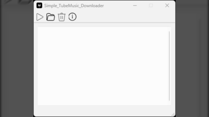
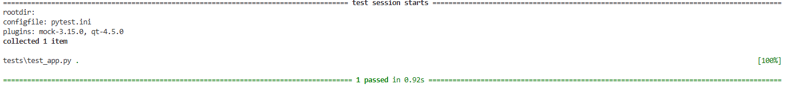

## 🎵 Simple-TubeMusic-Downloader
#### **PySide6 기반의 비동기 GUI 자동화 도구**

---

### 📺 시연 영상 (Demo)

> *클립보드 이벤트 감지 및 비동기 다운로드 프로세스 구현 시연*

### 📌 Motivation & Objective
*   **배경:** 반복적인 수동 URL 복사/붙여넣기 과정을 자동화하고, Windows 환경에서 안정적인 음원 추출 환경을 구축함.
*   **목표:** 비동기 설계와 방어적 프로그래밍을 통해 사용자 편의성과 프로그램 동작 신뢰성을 동시에 확보.

### ✅ 1. Implementation & Verification (구현 및 검증)
UI 응답성과 데이터 정합성 확보를 위해 설계 단계부터 검증 절차를 도입했습니다.
*   **UI/UX:** `dataChanged` 시그널을 활용한 실시간 클립보드 감지 및 자동 리스트업 구현 (**Pass**)
*   **Stability:** `QThread` 기반 비동기 작업 분리로 다운로드 중 UI 응답성(프리징 방지) 유지 (**Pass**)
*   **Portability:** `sys._MEIPASS` 경로 참조 로직 구현으로 배포 환경별 실행 안정성 확보 (**Pass**)
*   **Testing:** `pytest` 라이브러리를 활용하여 메인 윈도우 구성 요소 및 초기화 정합성 검증 (**Pass**)

> **📸 [이미지 첨부: Pytest 실행 결과 스크린샷]**
>
> 

### 📊 2. Performance & Reliability Data (성능 및 신뢰성)
사용자 경험과 저사양 기기 환경에서의 동작 신뢰성 사이의 균형을 고려했습니다.
*   **리소스 인식 설계:** CPU 점유율 급증 방지를 위해 단일 작업 순차 큐(Sequential Queue) 방식 채택.
*   **이어받기 기능:** 별도 설정 파일 없이 파일 시스템 상태 대조를 통한 자동 이어받기(Resume) 수행.
*   **동작 검증:** 저전력 프로세서(i5-7200U) 및 Windows 11 환경에서도 시스템 프리징 없는 안정적 동작 확인.

### 🛡️ 3. Security & Robustness (보안 및 견고성)
비정상 입력값으로 인한 프로그램 강제 종료를 방지하기 위해 입력 단계의 검증을 강화했습니다.
*   **데이터 무결성:** 정규표현식(Regex) 패턴 적용으로 유효 유튜브 URL만 선택적으로 수집하여 정합성 확보.
*   **예외 핸들링:** 네트워크 단절 및 엔진 에러 코드를 실시간 트래킹하여 예외 상황에 대한 대응력 강화.

### 💡 4. Engineer's Insights (엔지니어의 인사이트)
*   **QA 프로세스 습득:** `pytest`를 도입하여 최소 동작 단위를 검증하는 습관을 체득하고 Mock 객체 활용 학습 중.
*   **비판적 검토:** 시그널 구조 분석을 통해 데이터 감지에 적합한 최적의 시그널을 선택 적용하는 주도적 의사결정 수행.
*   **코드 독해력 배양:** 알고리즘 트레이닝(프로그래머스 197문제 완주)을 통해 시스템 최적화에 필요한 기본기 확보.

> **📸 [이미지 첨부: 프로그래머스 학습 현황 스크린샷]**
>
> 

---

### 🛠 Tech Stack
**Python 3.13 | PySide6 | yt-dlp | Pytest | Git | VS Code**

---
Copyright 2025. **TheSimplist-KOR** all rights reserved.